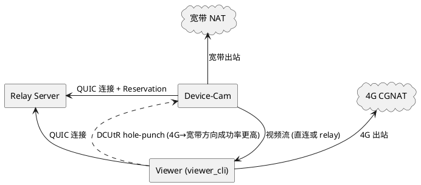
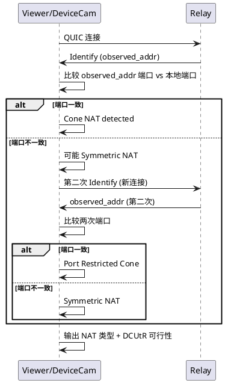
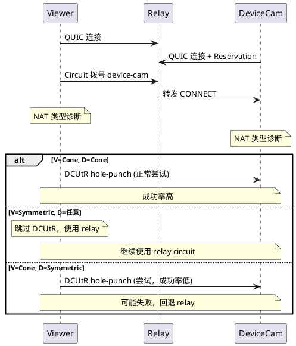
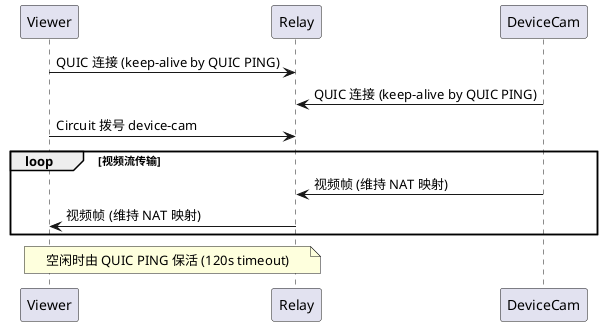
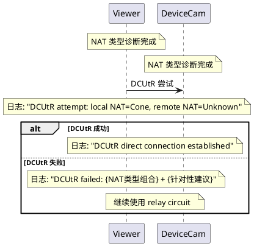

# 1. 组件定位

## 1.1 核心职责

本组件负责增强 P2P Camera 系统中 DCUtR 直连升级在跨 NAT（尤其是 4G CGNAT + 宽带 Cone NAT）场景下的成功率，通过 NAT 类型感知、打洞策略优化和诊断增强，使 viewer 与 device-cam 在不同 NAT 类型组合下尽可能建立直连。

## 1.2 核心输入

1. Relay 通过 identify 协议观察到的双方外部地址（公网 IP + 端口）
2. 本地监听地址列表（包含 LAN 本地 IP）
3. NAT 端口映射信息（通过 identify observed_addr 与本地监听端口对比获取）
4. DCUtR 打洞成功/失败事件
5. 连接建立事件（区分 relay circuit / QUIC direct / TCP）

## 1.3 核心输出

1. 基于 NAT 类型的打洞策略决策（尝试/跳过/优先级调整）
2. NAT 类型诊断结果（Full Cone / Restricted Cone / Port Restricted Cone / Symmetric / Unknown）
3. DCUtR 失败时的详细诊断日志（包含 NAT 类型、失败原因、建议）
4. 打洞保活机制维持 NAT 映射

## 1.4 职责边界

- 不负责修改 libp2p 核心库的 DCUtR 协议实现
- 不负责实现 TCP 打洞或端口预测（超出 libp2p DCUtR 能力范围）
- 不负责 relay server 的配置修改
- 不负责网络基础设施（端口映射、防火墙规则）的配置
- 不负责引入 TURN 协议（与 libp2p 生态不兼容）

# 2. 领域术语

**NAT 类型**
: 根据 RFC 3489 定义的 NAT 分类，影响 P2P 打洞可行性。包括 Full Cone、Restricted Cone、Port Restricted Cone、Symmetric 四种类型。

**CGNAT (Carrier-Grade NAT)**
: 运营商级 NAT，4G 网络通常使用此技术。特点是为每个连接分配不同端口（对称 NAT 行为），且严格阻止入站 UDP，导致 DCUtR 打洞几乎不可能成功。

**Cone NAT**
: 锥型 NAT，为同一内部端点分配固定的公网端口映射，外部主机可通过该映射端口发送数据。宽带网络通常使用此类型，DCUtR 打洞可行。

**Symmetric NAT**
: 对称 NAT，为每个不同的目标地址分配不同的公网端口。两端均为对称 NAT 时 DCUtR 无法成功。

**NAT 映射保活**
: 通过定期发送 UDP 包维持 NAT 映射表项不超时的机制。NAT 映射通常有 30-120 秒超时，超时后外部无法通过旧映射端口到达内部设备。

**DCUtR Listener/Dialer**
: DCUtR 协议中的两个角色。Listener 是被拨号方（先通过 Relay 注册的一方），Dialer 是拨号方。打洞时 Dialer 向 Listener 的候选地址发包，Listener 同时向 Dialer 的候选地址发包。

**Observed Address**
: Relay 通过 identify 协议观察到的节点外部地址（包含 NAT 映射后的公网 IP 和端口）。

**NAT Hairpin**
: 同一 NAT 后面的两个设备通过公网 IP 互相通信的能力。大多数路由器不支持此功能。

# 3. 角色与边界

## 3.1 核心角色

- **Viewer 用户**：运行 viewer_cli 连接 device-cam 观看视频流的终端用户，期望低延迟、高画质的视频体验。可能在 4G 网络或宽带网络下使用。
- **DeviceCam 运维者**：部署 device-cam 设备的人员，需要根据网络环境选择合适的部署策略（宽带 vs 4G）。

## 3.2 外部系统

- **Relay Server**：公网中继服务器，负责转发流量和提供 identify 观察地址。
- **NAT 设备**：viewer 和 device-cam 之间的 NAT 网关，决定 hole-punch 是否能成功。NAT 类型组合直接影响打洞策略。

## 3.3 交互上下文

# 4. DFX约束

## 4.1 性能

- NAT 类型诊断必须在 identify 事件后 5 秒内完成
- DCUtR hole-punch 尝试必须在 30 秒内完成（成功或失败）
- NAT 映射保活包间隔不应超过 10 秒
- DCUtR 失败不应影响 relay circuit 上的视频流传输

## 4.2 可靠性

- DCUtR 失败后必须回退到 relay circuit 继续传输，不能断开连接
- NAT 类型诊断结果为 Symmetric 时，应跳过 DCUtR 打洞尝试，直接使用 relay
- NAT 映射保活机制不应因单个包丢失而中断

## 4.3 可维护性

- NAT 类型诊断结果必须输出 INFO 级别日志
- DCUtR 失败时必须输出 WARN 级别日志，包含 NAT 类型、失败原因和诊断建议
- 打洞策略决策（尝试/跳过）必须输出 INFO 级别日志
- NAT 映射保活状态应输出 DEBUG 级别日志

## 4.4 兼容性

- 修改后的 viewer_cli 和 device-cam 必须与现有 relay server 兼容
- 不修改 libp2p 核心库代码
- 不修改 proto 协议定义
- NAT 类型诊断和策略优化为增量修改，不影响现有 LAN 地址候选注入逻辑

# 5. 核心能力

## 5.1 NAT 类型感知与诊断

### 5.1.1 业务规则

1. **NAT 端口映射一致性检测**：当 identify 协议报告 observed_addr 时，系统必须比较 observed_addr 的 UDP 端口与本地 QUIC 监听端口。

   a. 验收条件：[observed_addr UDP 端口 == 本地监听端口] → [判定为 Cone NAT 行为，日志输出 "Cone NAT detected"]

2. **多次观测端口一致性检测**：当收到多次 identify observed_addr 时，系统必须比较各次观测的 UDP 端口是否一致。

   a. 验收条件：[多次观测端口一致] → [判定为 Port Restricted Cone 或更宽松的 NAT 类型]
   b. 验收条件：[多次观测端口不一致] → [判定为 Symmetric NAT，日志输出 "Symmetric NAT detected"]

3. **4G 网络启发式检测**：当本地 IP 为 4G 网络典型网段（如 192.168.174.x、10.x.x.x 等）且 observed_addr 端口与本地端口不一致时，系统应推断为 CGNAT。

   a. 验收条件：[本地 IP 在 4G 典型网段 + 端口映射不一致] → [日志输出 "CGNAT detected, DCUtR unlikely to succeed"]

4. **NAT 类型结果输出**：NAT 类型诊断完成后，必须输出诊断结果和 DCUtR 可行性评估。

   a. 验收条件：[NAT 类型诊断完成] → [日志输出 NAT 类型 + "DCUtR feasible: YES/NO"]

### 5.1.2 交互流程

### 5.1.3 异常场景

1. **仅收到一次 identify 观测**

   a. 触发条件：与 Relay 只有一条连接，identify 只触发一次
   b. 系统行为：基于单次观测的端口映射一致性做初步判断，标记为 "Unknown (single observation)"
   c. 用户感知：日志输出初步判断结果，DCUtR 仍然尝试

2. **identify 观测缺少 UDP 端口**

   a. 触发条件：observed_addr 仅包含 TCP 协议
   b. 系统行为：标记 NAT 类型为 Unknown，日志提示 "TCP only observed, DCUtR unlikely"
   c. 用户感知：DCUtR 仍然尝试但日志提示成功率低

## 5.2 基于 NAT 类型的打洞策略

### 5.2.1 业务规则

1. **Symmetric NAT 跳过 DCUtR**（⚠️ 不可实现）：当本地 NAT 类型诊断为 Symmetric 时，理想情况下应跳过 DCUtR 打洞尝试，直接使用 relay circuit。但 libp2p DCUtR 没有运行时禁用机制，一旦通过 relay 建立连接就自动触发打洞，无法在应用层跳过。因此改为在日志中明确提示 Symmetric NAT 下 DCUtR 不可行。

   a. 验收条件：[本地 NAT 类型 = Symmetric] → [日志输出 "DCUtR prediction: likely FAIL - Symmetric NAT: DCUtR hole-punching will not succeed. Relay circuit will be used."] → [DCUtR 仍然自动触发但预期失败]

2. **对端 Symmetric NAT 时调整策略**：当通过 identify 获取的对端地址信息推断对端可能为 Symmetric NAT 时，系统应降低 DCUtR 优先级但仍尝试。

   a. 验收条件：[对端 observed_addr 端口与 listen_addrs 端口不一致] → [日志输出 "Remote peer may be behind Symmetric NAT, DCUtR success rate low"] → [仍然尝试 DCUtR]

3. **Cone NAT 正常尝试 DCUtR**：当本地 NAT 类型诊断为 Cone 时，系统应正常触发 DCUtR 打洞。

   a. 验收条件：[本地 NAT 类型 = Cone] → [正常触发 DCUtR 打洞]

4. **4G 网络特殊处理**：当检测到本地使用 4G 网络时，系统应输出建议日志，提示将 cam 端放在宽带网络下可提高打洞成功率。

   a. 验收条件：[本地为 4G 网络] → [日志输出 "4G/CGNAT detected: placing device-cam on broadband network increases DCUtR success rate"]

5. **禁止项**：禁止在 Symmetric NAT 场景下强制尝试 DCUtR 打洞（浪费带宽和延迟）。（⚠️ 实际无法禁止，libp2p DCUtR 自动触发，改为日志提示）

   a. 验收条件：[本地 NAT = Symmetric] → [DCUtR 仍然自动触发，但日志提前预测失败]

### 5.2.2 交互流程

### 5.2.3 异常场景

1. **NAT 类型未知时的策略**

   a. 触发条件：identify 观测数据不足，无法判断 NAT 类型
   b. 系统行为：默认尝试 DCUtR（保守策略，不跳过）
   c. 用户感知：DCUtR 正常尝试，失败后回退 relay

2. **NAT 类型诊断与实际不符**

   a. 触发条件：NAT 类型诊断为 Cone 但实际为 Symmetric（端口碰巧一致）
   b. 系统行为：DCUtR 尝试失败后回退 relay
   c. 用户感知：DCUtR 失败日志 + 回退 relay，视频流不中断

## 5.3 NAT 映射保活

### 5.3.1 业务规则

1. **QUIC 连接自动保活**：libp2p 的 QUIC 传输层已有内置的 keep-alive 机制（PING 帧），idle_connection_timeout 设为 120 秒。系统应确保此机制正常工作，不额外实现应用层保活。

   a. 验收条件：[QUIC 连接建立后] → [libp2p QUIC 层自动发送 PING 帧保活]

2. **Relay Circuit 保活**：通过 relay circuit 传输视频流时，持续的数据传输本身即维持 NAT 映射。系统应确保视频流传输不中断。

   a. 验收条件：[视频流通过 relay circuit 传输中] → [NAT 映射由数据流自动保活]

3. **空闲连接保活验证**：当 relay circuit 上无视频流传输时（如 viewer 尚未请求 stream），系统应确保 idle_connection_timeout 足够长以维持连接。

   a. 验收条件：[relay circuit 空闲] → [idle_connection_timeout=120s 维持连接]

4. **禁止项**：禁止实现自定义的 UDP 保活包发送机制（与 libp2p QUIC 传输层冲突）。

   a. 验收条件：[系统运行中] → [不发送自定义 UDP 保活包]

### 5.3.2 交互流程

### 5.3.3 异常场景

1. **NAT 映射超时导致连接断开**

   a. 触发条件：NAT 映射超时（通常 30-120 秒），外部无法通过旧映射端口到达
   b. 系统行为：QUIC 连接超时断开，触发重连
   c. 用户感知：视频流短暂中断后自动恢复

## 5.4 DCUtR 诊断日志增强

### 5.4.1 业务规则

1. **DCUtR 尝试前日志**：当 DCUtR 即将尝试打洞时（circuit 连接建立后），系统必须输出当前 NAT 类型诊断结果和预测。

   a. 验收条件：[circuit 连接建立] → [日志输出 "DCUtR prediction: likely SUCCESS/FAIL - {reason}"]

2. **DCUtR 失败后降级确认**：当 DCUtR 打洞失败后，系统必须确认 Relay Circuit 是否仍在工作，并输出降级信息。

   a. 验收条件：[DCUtR 失败 + Relay Circuit 仍在] → [日志输出 "Fallback: Relay circuit is still active, video/audio will continue via relay"]
   b. 验收条件：[DCUtR 失败 + Relay Circuit 已断] → [日志输出 "Fallback: Relay circuit may be lost, connection may drop soon"]

3. **DCUtR 失败日志增强**：当 DCUtR 打洞失败时，系统必须输出 NAT 类型组合信息和针对性建议。

   a. 验收条件：[DCUtR 失败 + 本地 Symmetric] → [日志输出 "DCUtR failed: local Symmetric NAT prevents hole-punching, relay circuit is the only option"]
   b. 验收条件：[DCUtR 失败 + 对端 Symmetric] → [日志输出 "DCUtR failed: remote peer appears to be behind Symmetric NAT, consider placing device-cam on broadband network"]
   c. 验收条件：[DCUtR 失败 + 双方 Cone] → [日志输出 "DCUtR failed: both peers appear to be behind Cone NAT, check firewall settings"]

3. **连接类型统计**：viewer 退出时，Summary 必须包含 NAT 类型和连接类型信息。

   a. 验收条件：[viewer 退出] → [Summary 包含 "Local NAT: {type}, Remote NAT: {type}, Connection: direct/relay"]

### 5.4.2 交互流程

### 5.4.3 异常场景

1. **NAT 类型诊断未完成时 DCUtR 已触发**

   a. 触发条件：DCUtR 在 identify 事件之前触发
   b. 系统行为：NAT 类型标记为 Unknown，正常尝试 DCUtR
   c. 用户感知：日志输出 "DCUtR attempt: local NAT=Unknown"

# 6. 数据约束

## 6.1 NAT 类型

- **枚举值**：FullCone, RestrictedCone, PortRestrictedCone, Symmetric, Unknown
- **默认值**：Unknown（诊断完成前）
- **DCUtR 可行性**：FullCone/RestrictedCone/PortRestrictedCone = 可行，Symmetric = 不可行，Unknown = 尝试

## 6.2 NAT 诊断观测记录

- **observed_addr**：identify 协议观测到的外部地址
- **观测次数**：至少 1 次，推荐 2 次以上以判断端口一致性
- **端口一致性**：多次观测的 UDP 端口是否一致

## 6.3 DCUtR 策略决策

- **Cone NAT**：正常尝试 DCUtR
- **Symmetric NAT (本地)**：无法跳过 DCUtR（libp2p 限制），日志提示不可行，DCUtR 仍然自动触发
- **Symmetric NAT (对端)**：尝试 DCUtR 但日志提示成功率低
- **Unknown**：默认尝试 DCUtR

## 6.4 idle_connection_timeout

- **值**：120 秒（已实现，保持不变）
- **用途**：维持空闲 QUIC 连接，支持 DCUtR 重试期间 keep-alive
