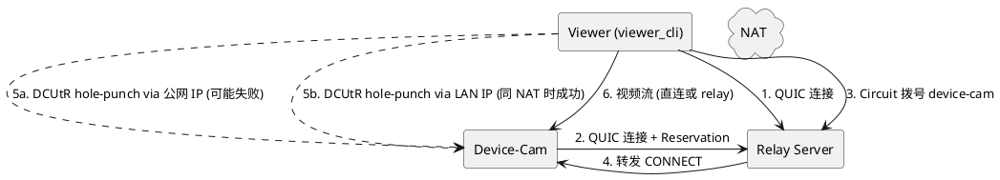
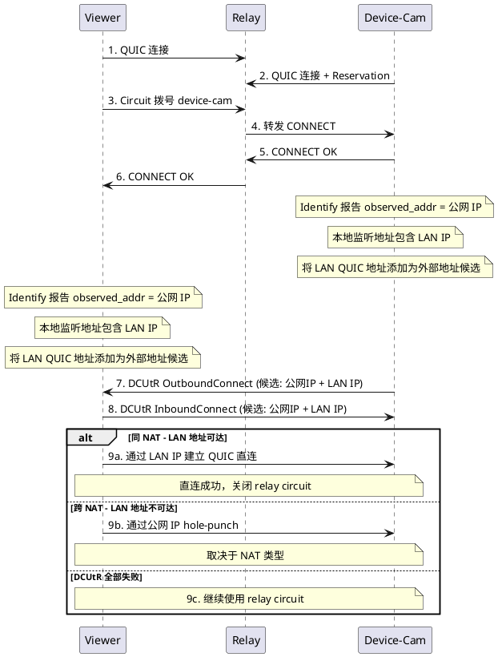
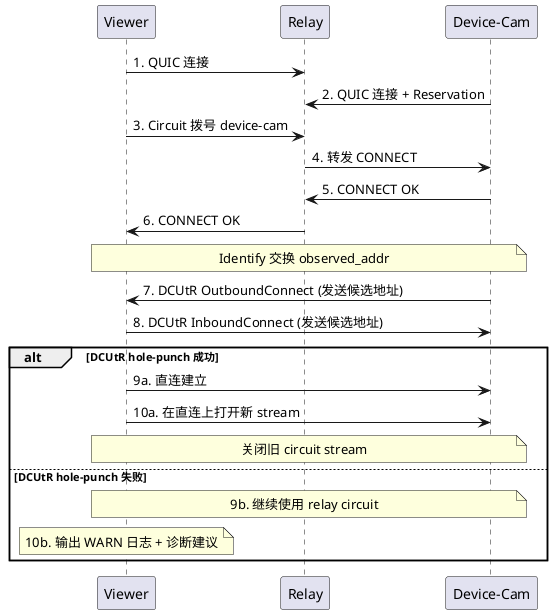
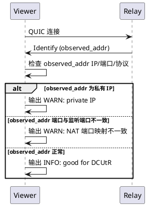

# 1. 组件定位

## 1.1 核心职责

本组件负责修复 P2P Camera 系统中 DCUtR 直连升级在同 NAT 环境下失败的问题，使 viewer 与 device-cam 在同一 NAT 后面能够通过 LAN 本地地址建立直连，减少 relay 转发带宽消耗。

## 1.2 核心输入

1. viewer 与 device-cam 通过 relay circuit 建立的连接
2. relay 通过 identify 协议观察到的双方外部地址（公网 IP）
3. DCUtR 握手交换的候选地址列表
4. 本地监听地址列表（包含 LAN 本地 IP）
5. NAT 端口映射信息（通过 identify observed_addr 获取）

## 1.3 核心输出

1. viewer 与 device-cam 之间的 P2P 直连连接（通过 LAN 地址或公网地址）
2. DCUtR 失败时的详细诊断日志（WARN 级别）
3. 直连建立后从 relay circuit 切换到直连的 stream 升级

## 1.4 职责边界

- 不负责修改 libp2p 核心库的 DCUtR 协议实现
- 不负责 NAT 穿透本身（依赖 libp2p DCUtR 协议）
- 不负责 relay server 的配置修改
- 不负责网络基础设施（端口映射、防火墙规则）的配置

# 2. 领域术语

**DCUtR (Direct Connection Upgrade through Relay)**
: libp2p 协议，允许两个通过 relay 中继连接的节点尝试建立直连，通过交换地址信息并同步发起连接（hole-punch）来穿透 NAT。

**Hole-punch**
: 两个 NAT 后面的节点同时向对方的 NAT 映射地址发送数据包，使 NAT 打开入站通道，从而建立直连的技术。

**Circuit Relay**
: libp2p 中继协议，允许无法直连的节点通过第三方 relay 节点转发流量。

**Reservation**
: device-cam 在 relay server 上注册自己的过程，使 relay 知道如何转发到该节点。

**Identify**
: libp2p 协议，节点间交换身份信息和监听地址，relay 会通过此协议观察节点的外部地址。

**Observed Address**
: relay 通过 identify 协议观察到的节点外部地址（包含 NAT 映射后的公网 IP 和端口）。

**NAT Hairpin**
: 也称 NAT Loopback 或 NAT Reflection，指同一 NAT 后面的两个设备通过公网 IP 互相通信的能力。大多数路由器不支持此功能。

**LAN Address Candidate**
: 节点的局域网本地地址（如 192.168.x.x），作为 DCUtR hole-punch 的候选地址之一。当两个节点在同一 NAT 后面时，LAN 地址可以直接路由，无需 NAT hairpin。

**idle_connection_timeout**
: libp2p swarm 配置项，定义连接上无活跃子流时的超时关闭时间。设为 0 表示立即关闭。

# 3. 角色与边界

## 3.1 核心角色

- **Viewer 用户**：运行 viewer_cli 连接 device-cam 观看视频流的终端用户，期望低延迟、高画质的视频体验。

## 3.2 外部系统

- **Relay Server**：公网中继服务器，负责转发流量和提供 identify 观察地址。
- **NAT 设备**：viewer 和 device-cam 之间的 NAT 网关，决定 hole-punch 是否能成功。

## 3.3 交互上下文

# 4. DFX约束

## 4.1 性能

- DCUtR hole-punch 尝试必须在 30 秒内完成（成功或失败）
- 直连建立后，视频流延迟应低于 relay 转发模式
- DCUtR 失败不应影响 relay circuit 上的视频流传输
- LAN 地址候选的添加不应增加 DCUtR 握手的额外延迟

## 4.2 可靠性

- DCUtR 失败后必须回退到 relay circuit 继续传输，不能断开连接
- DCUtR 重试最多 3 次（libp2p 默认），超过后放弃并记录日志
- viewer 的 idle_connection_timeout 不应导致活跃连接被意外关闭
- LAN 地址候选的添加不能影响跨 NAT 的正常 DCUtR 流程

## 4.3 可维护性

- DCUtR 失败时必须输出 WARN 级别日志，包含失败原因和诊断建议
- 日志应包含：NAT 类型推断、observed_addr 信息、hole-punch 地址
- viewer 和 device-cam 的 identify 事件应记录 observed_addr 的 IP 和协议类型
- LAN 地址候选的添加应有 INFO 级别日志

## 4.4 兼容性

- 修改后的 viewer_cli 和 device-cam 必须与现有 relay server 兼容
- 不修改 libp2p 核心库代码
- 不修改 proto 协议定义
- LAN 地址候选作为额外地址添加，不替换现有的公网地址候选

# 5. 核心能力

## 5.1 同 NAT 下 LAN 地址候选注入

### 5.1.1 业务规则

1. **LAN 地址候选注入**：当 device-cam 和 viewer 通过 relay circuit 建立连接后，DCUtR 握手交换的候选地址列表中必须包含 LAN 本地地址。

   a. 验收条件：[cam 和 viewer 在同一 NAT 后面] → [DCUtR 候选地址包含 LAN IP（如 192.168.x.x）]

2. **本地地址来源**：本地地址候选应来自本地监听地址（`NewListenAddr` 事件产生的地址），通过 `swarm.add_external_address()` 注入。使用黑名单策略：排除回环和未指定地址，其余本地网卡地址均可作为候选。

   a. 验收条件：[device-cam 监听在 192.168.1.108/udp/34500/quic-v1] → [该地址作为外部地址候选被 DCUtR 使用]
   b. 验收条件：[device-cam 监听在 172.32.0.93/udp/34500/quic-v1] → [该地址作为外部地址候选被 DCUtR 使用，尽管 172.32.x.x 不在 RFC 1918 范围]

3. **LAN 地址与公网地址共存**：LAN 地址候选应与公网地址候选共存，不替换公网地址。DCUtR 的 LruCache 会按频率排序，公网地址被更频繁观测到时仍优先。

   a. 验收条件：[同时存在公网和 LAN 地址候选] → [DCUtR 尝试所有候选地址，LAN 地址在同 NAT 场景下可达]

4. **仅注入 QUIC 协议的 LAN 地址**：只注入包含 `/quic-v1` 协议的 LAN 地址，TCP 地址不参与 QUIC hole-punch。

   a. 验收条件：[LAN 地址包含 /quic-v1] → [注入为外部地址候选]
   b. 验收条件：[LAN 地址仅包含 /tcp] → [不注入]

5. **禁止项**：禁止将 relayed 地址（包含 `/p2p-circuit`）作为候选地址注入。

   a. 验收条件：[地址包含 /p2p-circuit] → [不注入]

### 5.1.2 交互流程

### 5.1.3 异常场景

1. **LAN 地址注入后 DCUtR 仍然失败**

   a. 触发条件：LAN 地址不可达（不在同一子网）或防火墙阻止
   b. 系统行为：DCUtR 尝试所有候选地址后放弃，回退到 relay circuit
   c. 用户感知：日志输出 DCUtR 失败原因，视频流通过 relay 继续传输

2. **LAN 地址被错误注入到跨 NAT 场景**

   a. 触发条件：cam 和 viewer 不在同一 NAT 后面，LAN 地址不可路由
   b. 系统行为：DCUtR 尝试 LAN 地址失败后继续尝试公网地址，不影响最终结果
   c. 用户感知：DCUtR 可能多花几毫秒尝试不可达地址，但最终通过公网地址或 relay 成功

3. **多个 LAN 地址导致候选列表过长**

   a. 触发条件：设备有多个网卡（如 192.168.1.x, 192.168.0.x, 172.32.x.x）
   b. 系统行为：所有 QUIC LAN 地址都作为候选，DCUtR 的 LruCache 最多 20 个
   c. 用户感知：无负面影响，DCUtR 会按频率排序尝试

## 5.2 DCUtR 直连升级基础保障

### 5.2.1 业务规则

1. **viewer idle_connection_timeout 修复**：viewer 的 idle_connection_timeout 必须设置为大于 0 的值，禁止设置为 0。

   a. 验收条件：[viewer 启动] → [idle_connection_timeout 为 120 秒，与 device-cam 一致]

2. **DCUtR 失败日志增强**：当 DCUtR hole-punch 失败时，viewer 和 device-cam 必须输出 WARN 级别日志，包含失败原因。

   a. 验收条件：[DCUtR 失败] → [日志包含 "DCUtR hole punch FAILED" 和具体错误信息]

3. **DCUtR 失败诊断建议**：当 DCUtR 失败时，系统应根据 observed_addr 信息推断可能的原因并输出诊断建议。

   a. 验收条件：[observed_addr 为私有 IP] → [日志提示 "Observed address is private IP - DCUtR may fail"]
   b. 验收条件：[observed_addr 端口与监听端口不一致] → [日志提示 NAT 端口映射不一致]

4. **禁止项**：禁止在 DCUtR 失败后断开 relay circuit 上的视频流。

   a. 验收条件：[DCUtR 失败] → [relay circuit 上的视频流继续传输]

### 5.2.2 交互流程

### 5.2.3 异常场景

1. **DCUtR hole-punch 超时**

   a. 触发条件：双方尝试 hole-punch 但 NAT 不兼容（对称型 NAT）或防火墙阻止 UDP
   b. 系统行为：DCUtR 重试最多 3 次后放弃，回退到 relay circuit
   c. 用户感知：日志输出 "DCUtR hole punch FAILED" + 失败原因 + 诊断建议

2. **observed_addr 为私有 IP**

   a. 触发条件：relay 观察到的节点地址是私有 IP（如 172.x.x.x、192.168.x.x）
   b. 系统行为：DCUtR 尝试仍然执行，但日志输出警告
   c. 用户感知：日志提示 "Observed address is private IP - DCUtR may fail, check --external-ip config"

3. **viewer idle_connection_timeout 为 0 导致连接关闭**

   a. 触发条件：viewer 设置 idle_connection_timeout=0，DCUtR handler 的 keep-alive 被忽略
   b. 系统行为：连接可能被过早关闭，DCUtR 重试失败
   c. 用户感知：视频流断开，需要重连

4. **NAT 端口映射不一致**

   a. 触发条件：device-cam 监听端口 34500，但 NAT 映射为端口 1028，对称型 NAT 下 hole-punch 失败
   b. 系统行为：DCUtR 尝试连接到映射端口但失败
   c. 用户感知：日志提示 NAT 端口映射不一致，建议配置端口映射

## 5.3 Identify 诊断信息增强

### 5.3.1 业务规则

1. **viewer Identify 事件日志**：viewer 收到 Identify 事件时，必须记录 observed_addr 的完整信息（IP、端口、协议）。

   a. 验收条件：[viewer 收到 Identify 事件] → [日志包含 observed_addr 的 IP、端口、协议类型]

2. **device-cam Identify 事件日志**：device-cam 收到 Identify 事件时，必须记录 observed_addr 的完整信息。

   a. 验收条件：[device-cam 收到 Identify 事件] → [日志包含 observed_addr 的 IP、端口、协议类型]

3. **NAT 端口映射检测**：当 observed_addr 的端口与本地监听端口不一致时，必须输出 WARN 日志。

   a. 验收条件：[observed_addr 端口 != 本地监听端口] → [日志提示 NAT 端口映射不一致]

### 5.3.2 交互流程

### 5.3.3 异常场景

1. **observed_addr 缺少 IP 或端口**

   a. 触发条件：identify 返回的 observed_addr 格式不完整
   b. 系统行为：跳过 NAT 检测，输出 DEBUG 日志
   c. 用户感知：无直接影响，但 DCUtR 可能因地址不完整而失败

# 6. 数据约束

## 6.1 idle_connection_timeout

- **值**：必须大于 0 秒
- **推荐值**：120 秒（与 device-cam 一致）
- **禁止值**：0 秒（会导致活跃连接被意外关闭）

## 6.2 observed_addr

- **IP 地址**：应为公网 IP，私有 IP 表明 NAT 配置问题
- **端口**：应与本地监听端口一致，不一致表明 NAT 端口映射
- **协议**：应为 QUIC（/quic-v1），TCP 协议下 DCUtR 打洞几乎不可能

## 6.3 DCUtR 重试

- **最大重试次数**：3 次（libp2p 默认值，不可配置）
- **超时时间**：10 秒（libp2p DCUtR handler 默认值）

## 6.4 本地地址候选

- **协议要求**：必须包含 /quic-v1 后缀
- **IP 范围**：所有非回环、非未指定的本地网卡 IP（黑名单策略）
  - 包含：RFC 1918 私有地址（10.0.0.0/8, 172.16.0.0/12, 192.168.0.0/16）
  - 包含：VPN/Docker 等非标准私有地址（如 172.32.x.x，不在 RFC 1918 范围但实际为内网地址）
  - 包含：link-local 地址（169.254.0.0/16）
  - 包含：直接分配的公网 IP（如果机器有公网网卡）
- **排除**：127.0.0.0/8 回环地址、0.0.0.0 未指定地址
- **排除**：包含 /p2p-circuit 的 relayed 地址
- **最大数量**：受 DCUtR Candidates LruCache 限制（20 个）
