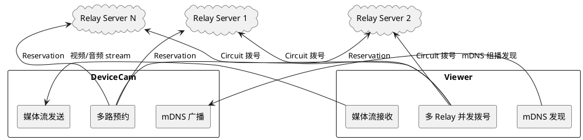
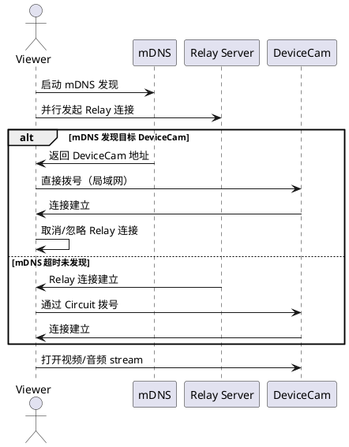
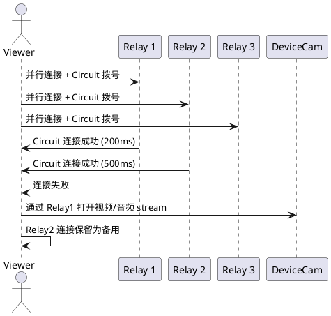
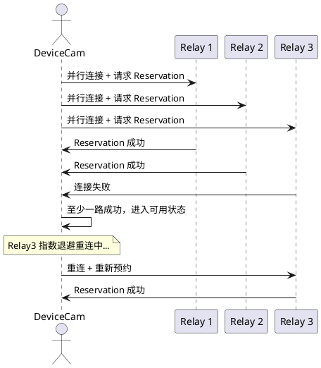
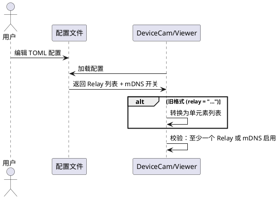

# 1. 组件定位

## 1.1 核心职责

本组件负责优化 P2P 摄像头监控系统的连接策略，实现局域网 mDNS 优先发现与多 Relay 并发拨号，提升连接成功率和建立速度。

## 1.2 核心输入

1. **mDNS 发现事件**：局域网内 DeviceCam 通过 mDNS 广播的 PeerId 和 Multiaddr
2. **Relay 配置列表**：用户配置的多个 Relay Server 地址（TOML 配置文件或命令行参数）
3. **DeviceCam PeerId**：Viewer 需要连接的目标摄像头标识
4. **Swarm 连接事件**：ConnectionEstablished / ConnectionClosed / OutgoingConnectionError 等网络事件

## 1.3 核心输出

1. **Viewer 与 DeviceCam 的媒体流连接**：视频/音频 stream 建立
2. **连接类型标识**：mDNS LAN Direct / Relay Circuit / DCUtR Direct
3. **多 Relay 预约状态**：DeviceCam 在多个 Relay 上的 Reservation 结果
4. **连接质量诊断信息**：NAT 类型、连接路径、降级建议

## 1.4 职责边界

1. **不负责**媒体编解码和帧传输逻辑（由现有 media_source / jitter_buffer 处理）
2. **不负责**Relay Server 本身的运行和管理（由 relay-server 独立处理）
3. **不负责**DCUtR 打洞协议的实现（由上游 libp2p-dcutr 处理）
4. **不负责**mDNS 协议底层实现（由上游 libp2p-mdns 处理）
5. **不改变**现有 stream 协议（VIDEO_PROTOCOL / AUDIO_PROTOCOL）的格式和语义

# 2. 领域术语

**mDNS 优先连接**
: 在局域网环境中，Viewer 优先通过 mDNS 服务发现 DeviceCam 并直接建立局域网连接，不依赖 Relay 是否在线。

**多 Relay 并发拨号**
: Viewer 同时向多个 Relay Server 发起连接和 Circuit 拨号请求，使用最先成功的连接建立媒体流，其余连接作为备用或关闭。

**多路预约**
: DeviceCam 同时在多个 Relay Server 上进行 Circuit Relay v2 Reservation，确保至少一个 Relay 可用。

**Relay 列表**
: 配置中定义的多个 Relay Server 地址的有序集合，每个元素包含完整的 Multiaddr（含 PeerId）。

**主 Relay / 备 Relay**
: Relay 列表中按顺序排列，第一个为主 Relay，其余为备 Relay。主 Relay 不可用时自动切换到备 Relay。

**连接策略**
: Viewer 建立 DeviceCam 连接的决策逻辑：mDNS 优先 → 多 Relay 并发 → DCUtR 升级。

# 3. 角色与边界

## 3.1 核心角色

- **Viewer 用户**：通过移动端或 CLI 工具查看摄像头画面的最终用户，期望快速、稳定地连接到摄像头
- **摄像头管理员**：配置 DeviceCam 参数（Relay 列表、mDNS 开关等）的运维人员

## 3.2 外部系统

- **DeviceCam**：运行在 RV1106 上的摄像头端程序，通过 mDNS 广播自身、在多个 Relay 上预约、接受 Viewer 连接
- **Relay Server**：公网中继服务器，为无法直连的 Viewer 和 DeviceCam 提供转发通道
- **mDNS 服务**：局域网内基于组播的服务发现协议，由 libp2p-mdns 提供

## 3.3 交互上下文

# 4. DFX 约束

## 4.1 性能

1. 局域网 mDNS 发现到连接建立，延迟 SHALL 不超过 3 秒
2. 多 Relay 并发拨号时，连接建立时间 SHALL 等于最快 Relay 的响应时间，而非所有 Relay 的串行累加
3. mDNS 发现和 Relay 拨号 SHALL 可并行执行，不互相阻塞
4. DeviceCam 多路预约 SHALL 并行发起，不串行等待

## 4.2 可靠性

1. 当所有 Relay 均不可用时，局域网 mDNS 连接 SHALL 仍能正常工作
2. 当 mDNS 不可用（非局域网）时，多 Relay 并发拨号 SHALL 仍能正常工作
3. DeviceCam 至少一个 Relay 预约成功 SHALL 视为可用状态
4. Viewer 连接建立后，如果当前 Relay 断开，SHALL 能切换到备 Relay 维持连接

## 4.3 安全性

1. mDNS 发现的 PeerId SHALL 与用户指定的目标 DeviceCam PeerId 进行校验，防止连接到错误设备
2. Relay 列表中的地址 SHALL 包含 PeerId，确保连接到正确的 Relay Server

## 4.4 可维护性

1. 连接建立过程 SHALL 输出清晰的日志，包括：mDNS 发现结果、每个 Relay 的拨号状态、最终使用的连接路径
2. 配置变更（新增/删除 Relay）SHALL 只需修改配置文件，无需修改代码

## 4.5 兼容性

1. 单 Relay 配置 SHALL 继续正常工作，与现有行为完全兼容
2. 不配置 mDNS 时，SHALL 回退到现有的 Relay 优先连接方式
3. 现有 viewer.toml / device-cam.toml 配置格式 SHALL 向后兼容

# 5. 核心能力

## 5.1 局域网 mDNS 优先连接

### 5.1.1 业务规则

1. **mDNS 优先规则**：When Viewer 启动连接且检测到局域网内有目标 DeviceCam 的 mDNS 广播，the Viewer SHALL 优先使用 mDNS 发现的局域网地址直接拨号，不等待 Relay 连接结果

   a. 验收条件：[Viewer 和 DeviceCam 在同一局域网，mDNS 发现目标 DeviceCam] → [Viewer 直接通过局域网地址拨号，不先连接 Relay]

2. **mDNS 与 Relay 并行规则**：When Viewer 启动连接，the Viewer SHALL 同时启动 mDNS 发现和 Relay 连接，不互相等待

   a. 验收条件：[Viewer 启动连接] → [mDNS 发现和 Relay 连接并行执行]

3. **mDNS 超时降级规则**：If mDNS 在 5 秒内未发现目标 DeviceCam，the Viewer SHALL 降级为通过 Relay 连接

   a. 验收条件：[mDNS 5 秒超时未发现目标] → [使用已建立的 Relay Circuit 连接]

4. **mDNS PeerId 校验规则**：When mDNS 发现设备，the Viewer SHALL 校验发现的 PeerId 与目标 DeviceCam PeerId 一致

   a. 验收条件：[mDNS 发现的 PeerId 与目标不匹配] → [忽略该发现结果，继续等待或降级]

5. **DeviceCam mDNS 广播规则**：While DeviceCam 运行，the DeviceCam SHALL 通过 mDNS 持续广播自身 PeerId 和监听地址

   a. 验收条件：[DeviceCam 启动] → [mDNS 广播开始，局域网内其他节点可发现]

6. **禁止项**：禁止在 mDNS 发现成功后仍等待 Relay 连接结果再决定使用哪条路径

   a. 验收条件：[mDNS 发现成功] → [立即使用局域网地址拨号，不等 Relay]

### 5.1.2 交互流程

### 5.1.3 异常场景

1. **mDNS 服务不可用**

   a. 触发条件：系统不支持组播或 mDNS 服务启动失败

   b. 系统行为：跳过 mDNS 发现，直接使用 Relay 连接

   c. 用户感知：日志提示 mDNS 不可用，连接通过 Relay 建立

2. **mDNS 发现超时**

   a. 触发条件：5 秒内未收到目标 DeviceCam 的 mDNS 响应

   b. 系统行为：降级为 Relay 连接

   c. 用户感知：日志提示 mDNS 超时，连接通过 Relay 建立

3. **mDNS 发现的设备非目标设备**

   a. 触发条件：mDNS 发现的 PeerId 与目标 DeviceCam PeerId 不匹配

   b. 系统行为：忽略该发现结果，继续等待或降级

   c. 用户感知：无感知，连接正常建立

## 5.2 多 Relay 并发拨号

### 5.2.1 业务规则

1. **并发拨号规则**：When Viewer 需要通过 Relay 连接 DeviceCam 且配置了多个 Relay，the Viewer SHALL 同时向所有 Relay 发起连接和 Circuit 拨号

   a. 验收条件：[配置了 3 个 Relay] → [同时向 3 个 Relay 发起连接和 Circuit 拨号]

2. **先到先用规则**：When 多个 Relay 的 Circuit 连接均成功，the Viewer SHALL 使用最先成功的连接建立媒体流，其余连接作为备用

   a. 验收条件：[Relay1 在 200ms 成功，Relay2 在 500ms 成功] → [使用 Relay1 的连接，Relay2 的连接保留为备用]

3. **部分失败容忍规则**：If 部分 Relay 连接失败，the Viewer SHALL 不影响其他 Relay 的连接尝试

   a. 验收条件：[3 个 Relay 中 1 个不可达] → [其余 2 个正常连接，整体不受影响]

4. **全部失败规则**：If 所有 Relay 连接均失败，the Viewer SHALL 返回连接失败错误

   a. 验收条件：[所有 Relay 均连接失败] → [返回连接失败，提示用户检查网络和 Relay 配置]

5. **单 Relay 兼容规则**：Where 只配置了一个 Relay，the Viewer SHALL 与现有行为完全一致

   a. 验收条件：[只配置 1 个 Relay] → [行为与当前单 Relay 实现完全相同]

### 5.2.2 交互流程

### 5.2.3 异常场景

1. **所有 Relay 均不可达**

   a. 触发条件：所有 Relay Server 网络不通或服务未运行

   b. 系统行为：返回连接失败错误

   c. 用户感知：错误提示"所有 Relay 连接失败，请检查网络和 Relay 配置"

2. **部分 Relay 响应超时**

   a. 触发条件：某些 Relay 响应缓慢，超过连接超时时间

   b. 系统行为：已成功的 Relay 连接正常使用，超时的 Relay 不影响整体

   c. 用户感知：连接正常建立，日志提示部分 Relay 超时

3. **Circuit 拨号被拒绝**

   a. 触发条件：Relay 连接成功但 DeviceCam 未在该 Relay 上预约

   b. 系统行为：该 Relay 的 Circuit 拨号失败，尝试其他 Relay

   c. 用户感知：连接通过其他 Relay 建立，或全部失败时提示

## 5.3 DeviceCam 多路预约

### 5.3.1 业务规则

1. **多路预约规则**：When DeviceCam 启动且配置了多个 Relay，the DeviceCam SHALL 同时在所有 Relay 上请求 Reservation

   a. 验收条件：[配置了 3 个 Relay] → [同时向 3 个 Relay 请求 Reservation]

2. **至少一路成功规则**：While 至少一个 Relay Reservation 成功，the DeviceCam SHALL 视为可用状态，可接受 Viewer 连接

   a. 验收条件：[3 个 Relay 中 1 个预约成功] → [DeviceCam 处于可用状态]

3. **预约丢失重试规则**：If 某个 Relay 的 Reservation 丢失，the DeviceCam SHALL 尝试重新预约该 Relay

   a. 验收条件：[Relay1 预约丢失但连接还在] → [立即重新请求 Relay1 的 Reservation]

4. **Relay 断开重连规则**：If 某个 Relay 连接断开，the DeviceCam SHALL 按指数退避策略重连该 Relay 并重新预约

   a. 验收条件：[Relay1 连接断开] → [指数退避重连 Relay1，重连后重新预约]

5. **单 Relay 兼容规则**：Where 只配置了一个 Relay，the DeviceCam SHALL 与现有行为完全一致

   a. 验收条件：[只配置 1 个 Relay] → [行为与当前单 Relay 实现完全相同]

### 5.3.2 交互流程

### 5.3.3 异常场景

1. **所有 Relay 均不可达**

   a. 触发条件：DeviceCam 启动时所有 Relay Server 均不可达

   b. 系统行为：持续按指数退避重连所有 Relay，mDNS 局域网连接仍可工作

   c. 用户感知：日志提示所有 Relay 不可达，局域网内 Viewer 仍可通过 mDNS 连接

2. **Reservation 被拒绝**

   a. 触发条件：Relay Server 拒绝 Reservation 请求（如达到最大预约数）

   b. 系统行为：该 Relay 预约失败，其他 Relay 正常工作

   c. 用户感知：日志提示该 Relay 预约被拒绝

3. **Relay 连接不稳定频繁断开**

   a. 触发条件：某个 Relay 网络不稳定，频繁断开重连

   b. 系统行为：按指数退避重连，不影响其他 Relay 的预约和连接

   c. 用户感知：日志提示该 Relay 频繁断开重连

## 5.4 多 Relay 配置管理

### 5.4.1 业务规则

1. **配置格式规则**：The 配置系统 SHALL 支持在 TOML 配置文件中定义多个 Relay 地址

   a. 验收条件：[配置文件包含多个 Relay 地址] → [程序正确解析并使用所有 Relay 地址]

2. **向后兼容规则**：Where 配置文件使用旧的单 Relay 格式（`relay = "..."`），the 配置系统 SHALL 正确解析为单元素列表

   a. 验收条件：[旧格式 `relay = "/ip4/..."`] → [等价于 `relays = ["/ip4/..."]`]

3. **命令行覆盖规则**：When 通过命令行参数指定 Relay 地址，the 命令行参数 SHALL 覆盖配置文件中的 Relay 列表

   a. 验收条件：[命令行指定 `--relay addr1 --relay addr2`] → [使用命令行指定的 Relay 列表]

4. **空配置校验规则**：If Relay 列表为空且 mDNS 未启用，the 系统 SHALL 报错退出

   a. 验收条件：[无 Relay 且无 mDNS] → [启动时报错"至少需要一个 Relay 或启用 mDNS"]

### 5.4.2 交互流程

### 5.4.3 异常场景

1. **配置文件格式错误**

   a. 触发条件：TOML 文件语法错误或字段类型不匹配

   b. 系统行为：启动时报错并退出，提示具体解析错误

   c. 用户感知：错误提示包含文件名和解析错误详情

2. **Relay 地址格式无效**

   a. 触发条件：Relay 地址不是合法的 Multiaddr 格式

   b. 系统行为：启动时报错并退出，提示具体哪个地址无效

   c. 用户感知：错误提示包含无效地址和原因

# 6. 数据约束

## 6.1 Relay 配置

1. **relays**：Relay Server 地址列表，每个元素为完整的 Multiaddr 字符串（含 `/p2p/<PeerId>`），至少包含 1 个元素（与 mDNS 互斥时可为空）
2. **relay**（旧格式）：单个 Relay Server 地址字符串，向后兼容，解析时转换为 relays 列表的第一个元素
3. **enable_mdns**：是否启用 mDNS 局域网发现，布尔值，默认 true

## 6.2 mDNS 发现结果

1. **PeerId**：发现的对端节点标识，必须与目标 DeviceCam PeerId 匹配
2. **Multiaddr**：发现的对端监听地址，必须为局域网私有 IP 的 QUIC 地址

## 6.3 连接状态

1. **连接类型**：枚举值，取值为 mDNS LAN Direct / Relay Circuit / DCUtR Direct / Disconnected
2. **活跃 Relay**：当前成功建立 Reservation 的 Relay PeerId 列表
3. **备用 Relay**：已连接但未用于当前媒体流的 Relay PeerId 列表
