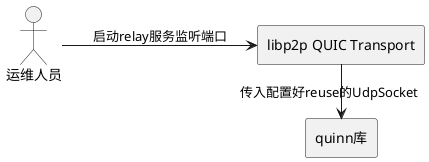
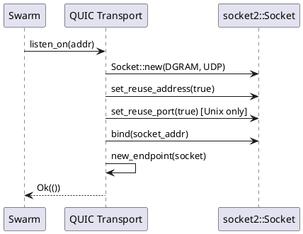
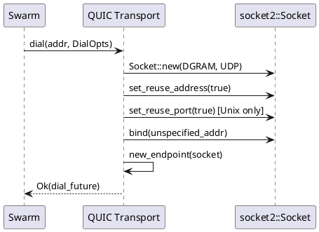

# **1. 组件定位**

## **1.1 核心职责**

本组件负责为QUIC transport的UDP socket设置端口复用选项（SO_REUSEADDR和SO_REUSEPORT），实现relay服务异常退出后能快速重新绑定端口。

## **1.2 核心输入**

1. QUIC transport监听请求：通过`swarm.listen_on()`传入的Multiaddr（包含IP和UDP端口）
2. QUIC transport拨号请求：通过`swarm.dial()`传入的Multiaddr及DialOpts（包含PortUse策略）

## **1.3 核心输出**

1. 设置了SO_REUSEADDR和SO_REUSEPORT的UDP socket，用于QUIC连接的监听和拨号
2. 绑定成功后返回的监听地址事件（TransportEvent::NewAddress）

## **1.4 职责边界**

1. 本组件不负责TCP transport的端口复用（TCP已有reuse实现）
2. 本组件不负责修改quinn库内部的socket创建逻辑
3. 本组件不负责修改relay协议层的业务逻辑

# **2. 领域术语**

**SO_REUSEADDR**
: 一个socket选项，允许绑定处于TIME_WAIT状态的地址，使进程异常退出后新进程能立即重新绑定同一端口。

**SO_REUSEPORT**
: 一个socket选项（仅Unix可用），允许多个socket绑定到完全相同的地址和端口，用于负载均衡和高可用场景。

**PortUse**
: libp2p core中定义的枚举类型，表示拨号时的端口使用策略，取值为New（分配新端口）或Reuse（复用已有端口）。

**QUIC Transport**
: 基于QUIC协议的libp2p传输层实现，使用UDP socket进行通信，由quinn库提供底层QUIC协议支持。

# **3. 角色与边界**

## **3.1 核心角色**

运维人员：负责部署和运维relay服务器，需要服务异常退出后能快速恢复

## **3.2 外部系统**

quinn库：提供QUIC协议实现，接收外部创建的UdpSocket作为传输层

## **3.3 交互上下文**

# **4. DFX约束**

## **4.1 性能**

设置socket选项的操作在socket创建阶段一次性完成，对运行时性能无影响。

## **4.2 可靠性**

When relay服务异常退出后重启，the QUIC transport shall能在1秒内成功重新绑定原端口。

## **4.3 安全性**

SO_REUSEPORT在Linux上需要进程使用相同的有效用户ID，不存在安全风险。

## **4.4 可维护性**

修改应与TCP transport的reuse实现保持一致的代码风格和条件编译策略。

## **4.5 兼容性**

1. SO_REUSEADDR在所有平台（Linux、macOS、Windows）均可用
2. SO_REUSEPORT仅在Unix平台（排除Solaris/Illumos）可用，需条件编译
3. 修改不应影响现有QUIC连接的建立和数据传输行为

# **5. 核心能力**

## **5.1 QUIC监听socket端口复用**

### **5.1.1 业务规则**

1. **监听socket必须设置SO_REUSEADDR**：在`create_socket`方法中，bind之前必须调用`socket.set_reuse_address(true)`
   - 验收条件：[调用listen_on绑定QUIC端口] → [底层socket的SO_REUSEADDR选项为true]

2. **监听socket必须设置SO_REUSEPORT**：在`create_socket`方法中，bind之前必须在Unix平台（排除Solaris/Illumos）调用`socket.set_reuse_port(true)`
   - 验收条件：[在Linux/macOS上调用listen_on绑定QUIC端口] → [底层socket的SO_REUSEPORT选项为true]
   - 验收条件：[在Windows上调用listen_on绑定QUIC端口] → [不调用set_reuse_port，编译通过]

3. **reuse设置必须在bind之前**：SO_REUSEADDR和SO_REUSEPORT必须在socket.bind()之前设置，否则无效
   - 验收条件：[代码审查create_socket方法] → [set_reuse_address和set_reuse_port调用在bind之前]

4. **禁止项**：禁止在非Unix平台调用set_reuse_port
   - 验收条件：[在Windows平台编译] → [不出现set_reuse_port相关编译错误]

### **5.1.2 交互流程**

### **5.1.3 异常场景**

1. **set_reuse_address调用失败**
   - 触发条件：内核不支持SO_REUSEADDR或权限不足
   - 系统行为：返回io::Error，listen_on返回TransportError
   - 用户感知：relay服务启动失败，日志显示端口绑定错误

2. **set_reuse_port调用失败**
   - 触发条件：内核版本过旧不支持SO_REUSEPORT
   - 系统行为：返回io::Error，listen_on返回TransportError
   - 用户感知：relay服务启动失败，日志显示端口绑定错误

## **5.2 QUIC拨号socket端口复用**

### **5.2.1 业务规则**

1. **拨号socket应当设置SO_REUSEADDR**：在`bound_socket`方法中，使用socket2创建socket并设置SO_REUSEADDR，替代当前的`UdpSocket::bind`直接调用
   - 验收条件：[调用dial创建出站QUIC连接] → [底层拨号socket的SO_REUSEADDR选项为true]

2. **拨号socket应当设置SO_REUSEPORT**：在`bound_socket`方法中，在Unix平台（排除Solaris/Illumos）设置SO_REUSEPORT
   - 验收条件：[在Linux/macOS上调用dial] → [底层拨号socket的SO_REUSEPORT选项为true]

### **5.2.2 交互流程**

### **5.2.3 异常场景**

1. **bound_socket中socket创建失败**
   - 触发条件：系统资源不足
   - 系统行为：返回Error::Io，dial返回TransportError
   - 用户感知：出站连接建立失败

# **6. 数据约束**

## **6.1 SocketAddr**

1. **ip**：监听地址的IP，支持IPv4和IPv6
2. **port**：监听端口号，relay默认使用4001
