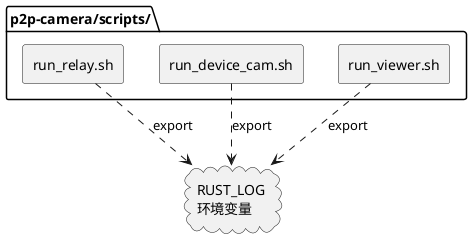

# **1. 实现模型**

## **1.1 上下文视图**

本修改涉及三个 Shell 运行脚本，修改范围仅限于各脚本中 `RUST_LOG` 环境变量的设置方式。不涉及 Rust 源码变更，不引入新的依赖或组件。



## **1.2 服务/组件总体架构**

无新增组件。修改仅涉及现有三个脚本的 `RUST_LOG` 设置行。

### 各脚本当前 RUST_LOG 设置方式

| 脚本 | 当前设置方式 | 位置 |
|------|-------------|------|
| `run_relay.sh` | `RUST_LOG=info "$BIN" ...` (内联) | 第27行 |
| `run_device_cam.sh` | `export RUST_LOG="${RUST_LOG:-info}"` | 第52行 |
| `run_viewer.sh` | `export RUST_LOG="${RUST_LOG:-info}"` | 第58行 |

### 修改策略

三个脚本统一采用相同的 `RUST_LOG` 设置模式：

```bash
export RUST_LOG="${RUST_LOG:+$RUST_LOG,}libp2p_dcutr=debug,libp2p_relay=debug"
```

**模式解析**：
- `${RUST_LOG:+$RUST_LOG,}` — 如果 `RUST_LOG` 已有值，则展开为 `原值,`；否则展开为空
- 效果：若用户未设置 `RUST_LOG`，最终值为 `libp2p_dcutr=debug,libp2p_relay=debug`；若用户已设置 `RUST_LOG=myapp=trace`，最终值为 `myapp=trace,libp2p_dcutr=debug,libp2p_relay=debug`

## **1.3 实现设计文档**

### run_relay.sh 修改

**当前代码**（第27行）：
```bash
RUST_LOG=info "$BIN" --port $PORT --key-file "$KEY_FILE"
```

**修改为**：
```bash
export RUST_LOG="${RUST_LOG:-info,}libp2p_dcutr=debug,libp2p_relay=debug"
exec "$BIN" --port $PORT --key-file "$KEY_FILE"
```

说明：原写法将 `RUST_LOG=info` 内联在命令前，仅对该命令生效。修改后改为 `export` 方式，默认值保留 `info` 并追加 dcutr/relay debug 配置。同时添加 `exec` 使 relay-server 进程替换 shell 进程。

### run_device_cam.sh 修改

**当前代码**（第52行）：
```bash
export RUST_LOG="${RUST_LOG:-info}"
```

**修改为**：
```bash
export RUST_LOG="${RUST_LOG:+$RUST_LOG,}libp2p_dcutr=debug,libp2p_relay=debug"
```

说明：原默认值 `info` 被移除，因为 Rust 的 `env_logger` 在未指定全局级别时，会按各模块的设置分别输出日志。若用户需要全局 info 级别，可自行设置 `RUST_LOG=info` 后执行脚本。

### run_viewer.sh 修改

**当前代码**（第58行）：
```bash
export RUST_LOG="${RUST_LOG:-info}"
```

**修改为**：
```bash
export RUST_LOG="${RUST_LOG:+$RUST_LOG,}libp2p_dcutr=debug,libp2p_relay=debug"
```

说明：与 `run_device_cam.sh` 相同的修改策略。

# **2. 接口设计**

## **2.1 总体设计**

本次修改不涉及新增接口。仅修改脚本内部的环境变量设置，脚本对外的参数接口（用法、参数列表）保持不变。

## **2.2 接口清单**

| 脚本 | 对外接口（不变） |
|------|-----------------|
| `run_relay.sh` | `[debug|release]` |
| `run_device_cam.sh` | `<relay_addr> [video_file]` |
| `run_viewer.sh` | `<relay_addr> <device_cam_peer> <udp_port> <external_ip>` |

# **4. 数据模型**

## **4.1 设计目标**

无数据模型变更。`RUST_LOG` 环境变量的值格式遵循 Rust `env_logger` 的标准规范。

## **4.2 模型实现**

`RUST_LOG` 值格式：`[existing_modules,]libp2p_dcutr=debug,libp2p_relay=debug`

示例值：
- 未设置时：`libp2p_dcutr=debug,libp2p_relay=debug`
- 用户设置 `RUST_LOG=info` 时：`info,libp2p_dcutr=debug,libp2p_relay=debug`
- 用户设置 `RUST_LOG=myapp=trace` 时：`myapp=trace,libp2p_dcutr=debug,libp2p_relay=debug`
