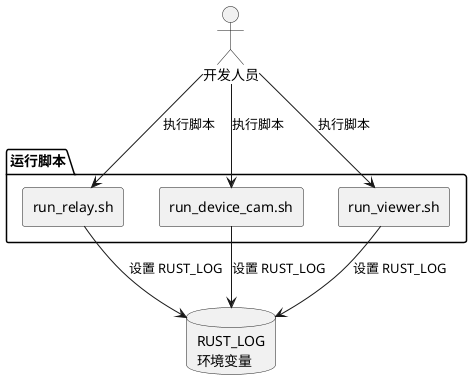
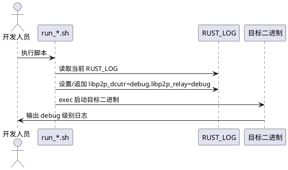

# **1. 组件定位**

## **1.1 核心职责**

本组件负责在 P2P Camera 运行脚本中配置 libp2p dcutr 和 relay 模块的调试日志级别，实现开发调试阶段的日志可观测性。

## **1.2 核心输入**

1. 用户通过命令行执行 run 脚本启动各组件（relay、device-cam、viewer）
2. 环境变量 `RUST_LOG` 的现有值（可能为空或已设置）

## **1.3 核心输出**

1. 各运行脚本执行时，`RUST_LOG` 环境变量包含 `libp2p_dcutr=debug,libp2p_relay=debug` 配置
2. 终端输出 libp2p dcutr 和 relay 模块的 debug 级别日志

## **1.4 职责边界**

- 本组件仅负责在运行脚本中设置 `RUST_LOG` 环境变量
- 不负责修改 Rust 源码中的日志逻辑
- 不负责日志的存储、转发或分析
- 不负责其他 libp2p 模块的日志级别配置

# **2. 领域术语**

**RUST_LOG**
: Rust 生态中用于控制日志输出级别的标准环境变量，支持按模块路径设置不同级别，格式为 `module=level`，多个模块用逗号分隔。

**libp2p_dcutr**
: libp2p 中的 Direct Connection Upgrade through Relay 模块，负责在 relay 中继连接基础上建立直连。

**libp2p_relay**
: libp2p 中的 Relay 模块，负责提供中继服务，使无法直连的节点通过中继节点通信。

**debug 级别**
: 日志级别之一，输出详细的调试信息，包括连接建立、协议交互等内部状态。

# **3. 角色与边界**

## **3.1 核心角色**

- **开发人员**：通过运行脚本启动 P2P Camera 各组件，需要查看 dcutr 和 relay 模块的调试日志以排查连接问题

## **3.2 外部系统**

- **Relay Server**：通过 `run_relay.sh` 启动，需要输出 relay 模块 debug 日志
- **Device Cam**：通过 `run_device_cam.sh` 启动，需要输出 dcutr 和 relay 模块 debug 日志
- **Viewer**：通过 `run_viewer.sh` 启动，需要输出 dcutr 和 relay 模块 debug 日志

## **3.3 交互上下文**

# **4. DFX约束**

## **4.1 性能**

- 日志输出不应显著影响组件运行性能
- debug 级别日志仅在开发调试阶段使用，生产环境应使用 info 或 warn 级别

## **4.2 可靠性**

- `RUST_LOG` 设置不应影响脚本的原有执行逻辑
- 若用户已通过环境变量设置了 `RUST_LOG`，应尊重用户设置

## **4.3 安全性**

- debug 日志可能包含连接地址、PeerId 等信息，不应在生产环境开启

## **4.4 可维护性**

- 日志级别配置应集中在脚本中，便于统一调整
- 配置方式应与现有 `RUST_LOG` 设置模式保持一致

## **4.5 兼容性**

- 修改后的脚本应保持原有参数和用法不变
- 不应破坏现有的 `RUST_LOG` 覆盖机制

# **5. 核心能力**

## **5.1 运行脚本日志级别配置**

### **5.1.1 业务规则**

1. **RUST_LOG 默认值规则**：三个运行脚本（run_relay.sh、run_device_cam.sh、run_viewer.sh）必须设置 `RUST_LOG` 环境变量，包含 `libp2p_dcutr=debug,libp2p_relay=debug`

   a. 验收条件：[执行任一运行脚本] → [RUST_LOG 环境变量包含 libp2p_dcutr=debug 和 libp2p_relay=debug]

2. **用户覆盖规则**：当用户在执行脚本前已设置 `RUST_LOG` 环境变量时，脚本应保留用户设置并追加 dcutr 和 relay 的 debug 配置

   a. 验收条件：[用户设置 RUST_LOG=myapp=trace 后执行脚本] → [最终 RUST_LOG 包含用户原有设置及 libp2p_dcutr=debug,libp2p_relay=debug]

3. **禁止项**：禁止硬编码覆盖用户已有的 RUST_LOG 设置

   a. 验收条件：[用户设置 RUST_LOG=warn 后执行脚本] → [不应丢失 warn 级别配置]

### **5.1.2 交互流程**

### **5.1.3 异常场景**

1. **RUST_LOG 已包含同名模块配置**

   a. 触发条件：用户已设置 RUST_LOG 中包含 libp2p_dcutr 或 libp2p_relay 的配置

   b. 系统行为：追加配置，Rust env_logger 按后设置（更具体）的级别生效

   c. 用户感知：最终以脚本中设置的 debug 级别为准

# **6. 数据约束**

## **6.1 RUST_LOG 环境变量**

1. **格式**：逗号分隔的 `module=level` 键值对，如 `libp2p_dcutr=debug,libp2p_relay=debug`
2. **必须包含的模块**：`libp2p_dcutr` 和 `libp2p_relay`
3. **必须设置的级别**：`debug`
4. **与现有值的关系**：应追加到现有 RUST_LOG 值之后，用逗号分隔
